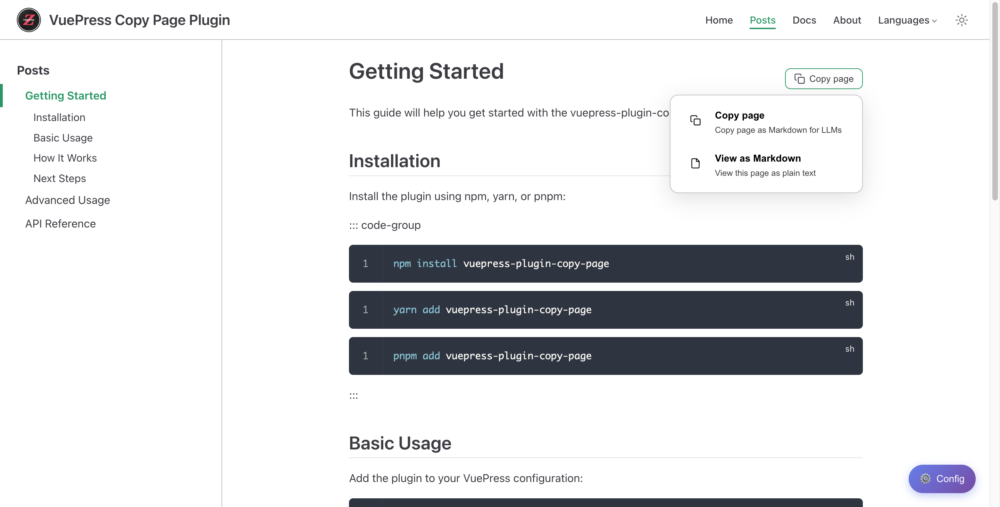
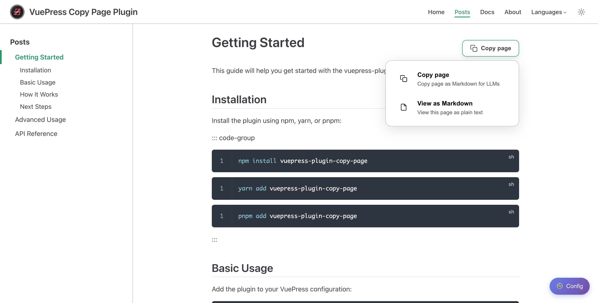

# vuepress-plugin-copy-page

[English](#english) | [中文](#中文)

---

> A VuePress 2 plugin that adds a "Copy Page" button to documentation pages, allowing users to copy page content as original Markdown format. Perfect for sharing documentation with LLMs like ChatGPT, Claude, and other AI tools.

> 一个 VuePress 2 插件，在文档页面上添加"复制页面"按钮，允许用户以原始 Markdown 格式复制页面内容。非常适合与 ChatGPT、Claude 等 AI 工具分享文档。

[](https://www.npmjs.com/package/vuepress-plugin-copy-page)
[](https://github.com/zhaofutao04/vuepress-plugin-copy-page/tags)
[](https://github.com/zhaofutao04/vuepress-plugin-copy-page/actions/workflows/npm-publish.yml)
[](LICENSE)
[](https://www.npmjs.com/package/vuepress-plugin-copy-page)
---

## English {#english}

### Features

- **Copy as Markdown** - Copy the original Markdown source of any page to clipboard
- **View as Markdown** - Open the page content as plain text in a new tab
- **Floating widget** - Non-intrusive dropdown menu positioned near the page title
- **Smart visibility** - Show the button only on specific paths using include/exclude patterns
- **Dark mode support** - Automatically adapts to your theme's color scheme
- **Built-in source extraction** - No additional plugins or configuration needed
- **Multiple h1 selector support** - Works with different VuePress themes
- **Toast notifications** - Visual feedback when copying succeeds or fails
- **Two style modes** - Choose between compact `simple` mode or prominent `rich` mode

### Style Modes

The plugin supports two visual styles:

| Simple Mode (default) | Rich Mode |
|:---------------------:|:---------:|
|  |  |
| Compact button, minimal footprint | Larger button, enhanced visuals |

### Installation

```bash
# npm
npm install vuepress-plugin-copy-page

# yarn
yarn add vuepress-plugin-copy-page

# pnpm
pnpm add vuepress-plugin-copy-page

# bun
bun add vuepress-plugin-copy-page
```

### Quick Start

#### 1. Register the plugin

```ts
// .vuepress/config.ts
import { defineUserConfig } from 'vuepress'
import { copyPagePlugin } from 'vuepress-plugin-copy-page'

export default defineUserConfig({
  plugins: [
    copyPagePlugin({
      includes: ['/posts/', '/docs/']
    })
  ]
})
```

#### 2. Import the styles

```ts
// .vuepress/client.ts
import { defineClientConfig } from 'vuepress/client'
import 'vuepress-plugin-copy-page/styles'

export default defineClientConfig({})
```

### Configuration

#### Options

| Option | Type | Default | Description |
|--------|------|---------|-------------|
| `includes` | `string[]` | `['/posts/']` | Path prefixes where the copy button should appear |
| `excludes` | `string[]` | `[]` | Path prefixes where the copy button should NOT appear |
| `position` | `'top-right' \| 'top-left' \| 'bottom-right' \| 'bottom-left'` | `'top-right'` | Position of the copy button |
| `styleMode` | `'simple' \| 'rich'` | `'simple'` | Style mode - `simple` for compact button, `rich` for larger, more prominent button |

#### Example

```ts
copyPagePlugin({
  includes: ['/posts/', '/docs/', '/guide/'],
  excludes: ['/about/', '/drafts/'],
  position: 'top-right',
  styleMode: 'rich'  // or 'simple' (default)
})
```

### Browser Support

- **Clipboard API** (`navigator.clipboard`) - Required
- Chrome 66+, Firefox 63+, Safari 13.1+
- Requires HTTPS or localhost

### Compatibility

- **VuePress:** >=2.0.0-rc.0
- **Vue:** ^3.0.0

---

## 中文 {#中文}

### 功能特性

- **复制为 Markdown** - 将任何页面的原始 Markdown 源码复制到剪贴板
- **查看为 Markdown** - 在新标签页中以纯文本格式打开页面内容
- **浮动组件** - 靠近页面标题的非侵入式下拉菜单
- **智能可见性** - 使用包含/排除模式仅在特定路径显示按钮
- **深色模式支持** - 自动适应你的主题配色方案
- **内置源码提取** - 无需额外插件或配置
- **多种 h1 选择器支持** - 适用于不同的 VuePress 主题
- **Toast 通知** - 复制成功或失败时的视觉反馈
- **两种样式模式** - 可选择紧凑的 `simple` 模式或突出的 `rich` 模式

### 样式模式

插件支持两种视觉样式：

| 简约模式（默认） | 丰富模式 |
|:---------------:|:--------:|
|  |  |
| 紧凑按钮，占用空间小 | 更大的按钮，视觉效果更突出 |

### 安装

```bash
# npm
npm install vuepress-plugin-copy-page

# yarn
yarn add vuepress-plugin-copy-page

# pnpm
pnpm add vuepress-plugin-copy-page

# bun
bun add vuepress-plugin-copy-page
```

### 快速开始

#### 1. 注册插件

```ts
// .vuepress/config.ts
import { defineUserConfig } from 'vuepress'
import { copyPagePlugin } from 'vuepress-plugin-copy-page'

export default defineUserConfig({
  plugins: [
    copyPagePlugin({
      includes: ['/posts/', '/docs/']
    })
  ]
})
```

#### 2. 导入样式

```ts
// .vuepress/client.ts
import { defineClientConfig } from 'vuepress/client'
import 'vuepress-plugin-copy-page/styles'

export default defineClientConfig({})
```

### 配置

#### 选项

| 选项 | 类型 | 默认值 | 描述 |
|------|------|--------|------|
| `includes` | `string[]` | `['/posts/']` | 复制按钮应出现的路径前缀 |
| `excludes` | `string[]` | `[]` | 复制按钮不应出现的路径前缀 |
| `position` | `'top-right' \| 'top-left' \| 'bottom-right' \| 'bottom-left'` | `'top-right'` | 复制按钮的位置 |
| `styleMode` | `'simple' \| 'rich'` | `'simple'` | 样式模式 - `simple` 为紧凑按钮，`rich` 为更大更突出的按钮 |

#### 示例

```ts
copyPagePlugin({
  includes: ['/posts/', '/docs/', '/guide/'],
  excludes: ['/about/', '/drafts/'],
  position: 'top-right',
  styleMode: 'rich'  // 或 'simple'（默认）
})
```

### 浏览器支持

- **剪贴板 API** (`navigator.clipboard`) - 必需
- Chrome 66+, Firefox 63+, Safari 13.1+
- 需要 HTTPS 或 localhost

### 兼容性

- **VuePress:** >=2.0.0-rc.0
- **Vue:** ^3.0.0

---

## API Reference | API 参考

### Type Definitions | 类型定义

```typescript
interface CopyPageOptions {
  /**
   * Page path patterns where the copy button should appear
   * 复制按钮应出现的页面路径模式
   * @default ['/posts/']
   */
  includes?: string[]

  /**
   * Page path patterns where the copy button should NOT appear
   * 复制按钮不应出现的页面路径模式
   * @default []
   */
  excludes?: string[]

  /**
   * Position of the copy button
   * 复制按钮的位置
   * @default 'top-right'
   */
  position?: 'top-right' | 'top-left' | 'bottom-right' | 'bottom-left'

  /**
   * Style mode for the button
   * 按钮样式模式
   * - simple: compact button size
   * - rich: larger, more prominent button
   * @default 'simple'
   */
  styleMode?: 'simple' | 'rich'
}
```

---

## Changelog | 更新日志

### v1.1.5
- Add `styleMode` option with `simple` and `rich` modes | 添加 `styleMode` 选项，支持 `simple` 和 `rich` 两种样式模式
- Enhanced button styles: bolder titles, lighter descriptions | 优化按钮样式：标题加粗，描述文字变淡
- Improved icon design with cleaner strokes | 优化图标设计，线条更清晰

### v1.0.2
- Fix h1 selector to support multiple VuePress themes | 修复 h1 选择器以支持多种 VuePress 主题
- Fix async event handler for copy operations | 修复复制操作的异步事件处理

### v1.0.1
- Initial stable release | 初始稳定版本
- Basic copy and view functionality | 基本复制和查看功能

---

## License | 许可证

[MIT](LICENSE)

## Author | 作者

老Z

## Links | 链接

- GitHub: [zhaofutao04/vuepress-plugin-copy-page](https://github.com/zhaofutao04/vuepress-plugin-copy-page)
- Issues: [GitHub Issues](https://github.com/zhaofutao04/vuepress-plugin-copy-page/issues)
- npm: [vuepress-plugin-copy-page](https://www.npmjs.com/package/vuepress-plugin-copy-page)
